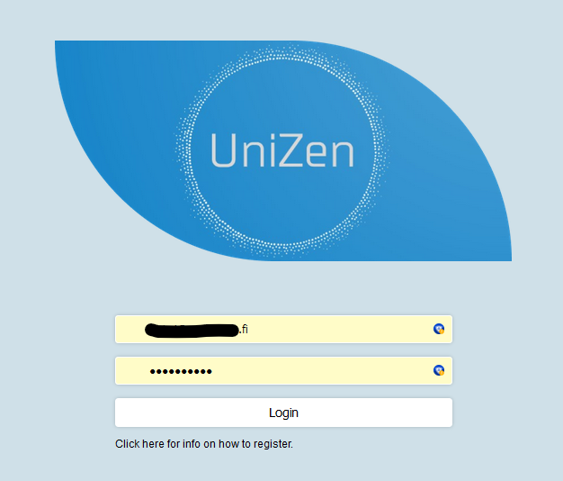
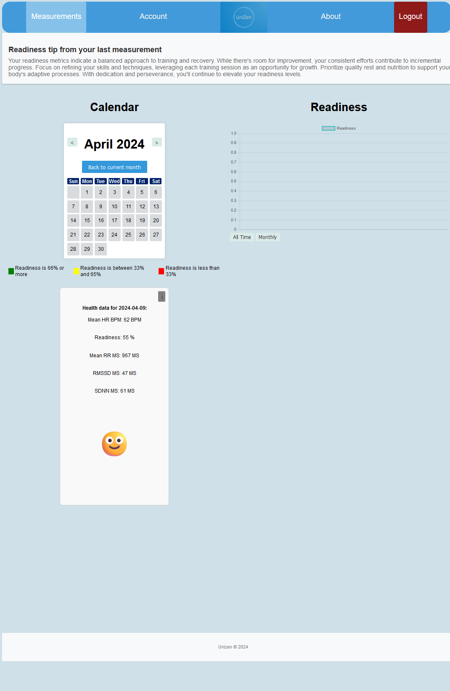
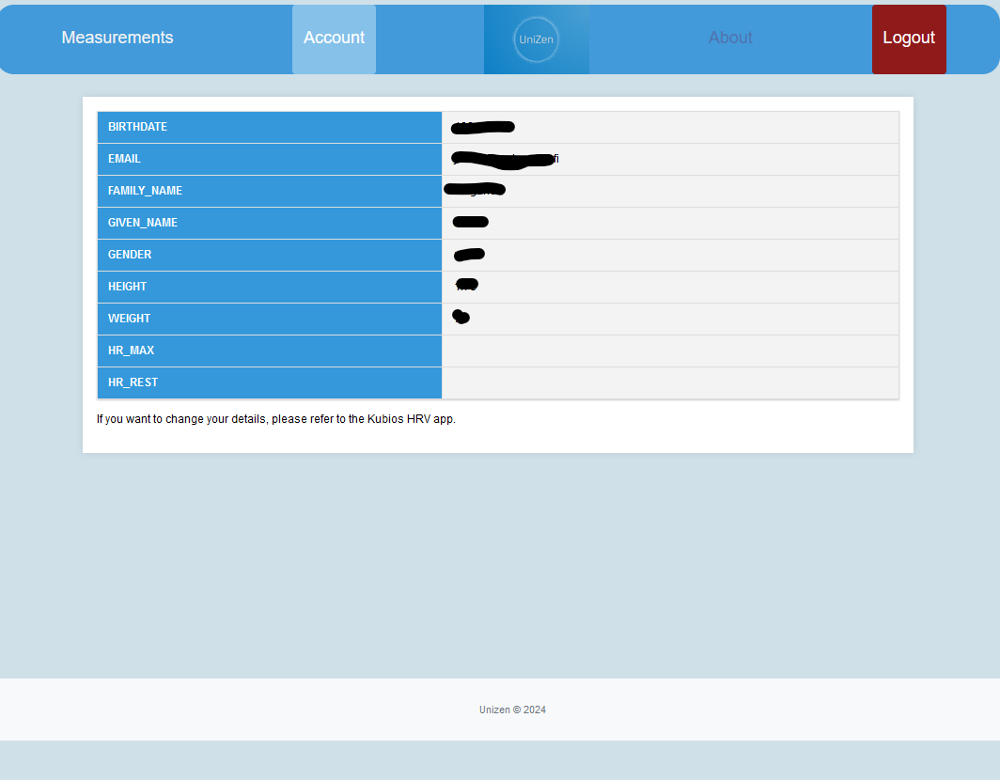
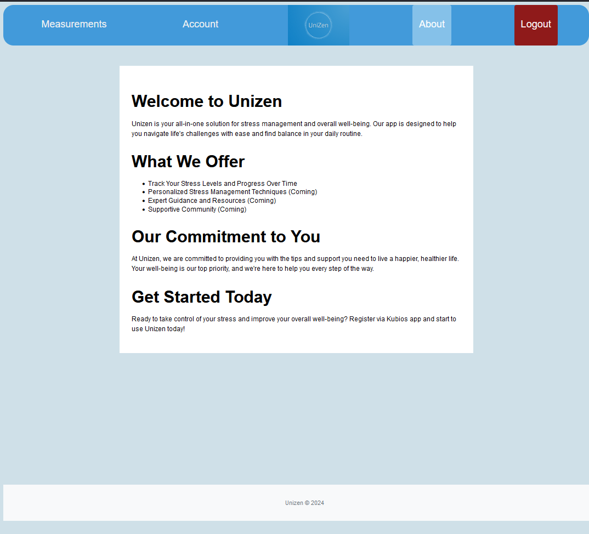
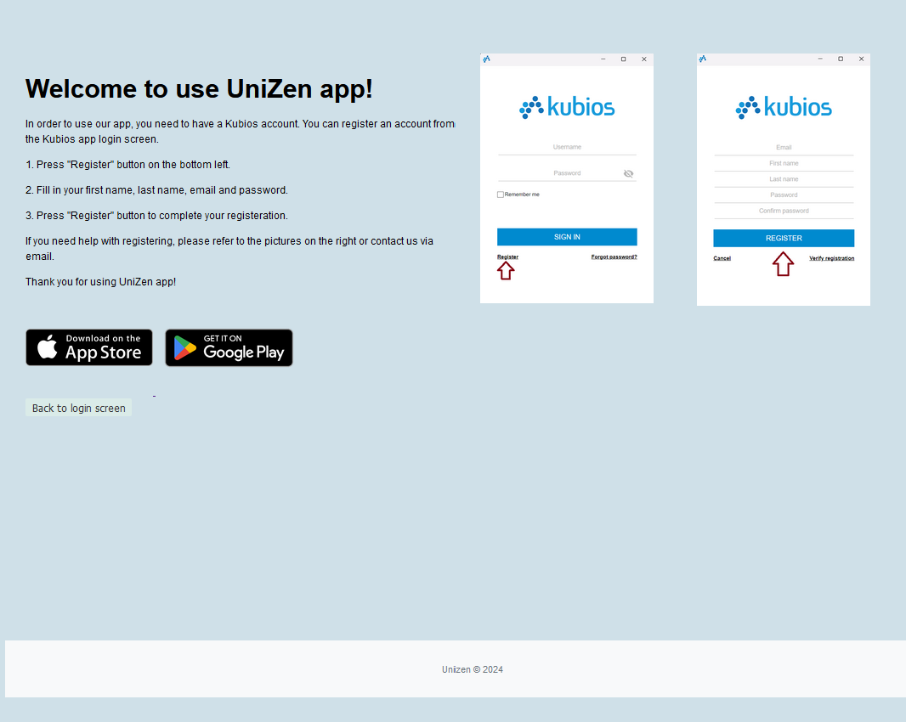

# UniZen

## Description

UniZen is a web application designed to help users monitor and manage their stress levels through detailed heart rate variability (HRV) analysis. Utilizing data from the Kubios HRV platform, UniZen provides a user-friendly interface for tracking daily readiness levels and offers personalized insights and recommendations to improve users' well-being.

## Screenshots










## Client Setup

The client application uses Vite for development and build processes. Below are the scripts and dependencies required.

### Scripts

To run the client application, use the following npm scripts:

- **Development Server**: `npm run dev` - Starts the Vite development server.
- **Build**: `npm run build` - Compiles and bundles the client application for production deployment.
- **Preview**: `npm run preview` - Serves the production build locally for preview.

### Dependencies
```json
    "apidoc": "^1.2.0",
    "bcryptjs": "^2.4.3",
    "cors": "^2.8.5",
    "dotenv": "^16.4.1",
    "express": "^4.19.2",
    "express-session": "^1.18.0",
    "express-validator": "^7.0.1",
    "jsonwebtoken": "^9.0.2",
    "mysql2": "^3.9.1",
    "node-fetch": "^3.3.2"
```
### DevDependencies

- vite: `^5.1.0`

These packages are used during development and are not required in the production environment:

- **eslint**: `^8.56.0` - For ensuring code quality and consistency.
- **eslint-config-google**: `^0.14.0` - Google's ESLint configuration.
- **nodemon**: `^3.1.0` - Utility that automatically restarts the node application when file changes are detected.

## Server Setup

The server side of the application requires several dependencies to run properly and some development dependencies for an efficient development workflow.

These packages are necessary for the server application's runtime:


- **bcryptjs**: `^2.4.3` - For hashing and securing passwords.
- **cors**: `^2.8.5` - To enable CORS (Cross-Origin Resource Sharing).
- **dotenv**: `^16.4.1` - To load environment variables from a `.env` file.
- **express**: `^4.18.2` - The web application framework.
- **express-validator**: `^7.0.1` - For validating and sanitizing input data.
- **jsonwebtoken**: `^9.0.2` - For generating and verifying JSON Web Tokens.
- **mysql2**: `^3.9.1` - MySQL client for Node.js.


### Installing Dependencies

After cloning the repository, navigate to the server directory and run the following command to install all the necessary dependencies:

```bash
npm install
```


## Database Schema


## Wireframe

Wireframe was designed using Figma. You can check it [here](https://www.figma.com/file/6lmN3xYFFMHrEC2vmHnUJJ/UniZen?type=design&node-id=0-1&mode=design)


## Project Features

- User Authentication: Secure login system that uses Kubios credentials and Json Web Token (JWT) ensuring data privacy and security.

- HRV Data Integration: Automatically fetches HRV data from the Kubios Cloud API, providing users with the most up-to-date information on their readiness state.

- Daily Stress Level Monitoring: Displays daily stress levels in a visually intuitive calendar format, where days are color-coded based on the user's stress levels.

- Interactive Calendar: Users can navigate through months and click on specific days to get detailed views of their stress levels and HRV data.

- Personalized Tips: Based on the user's last readiness readings, the application offers personalized tips and recommendations for stress management.

- Interactive Graphs: View historical HRV data through dynamic graphs, which display data over the entire period or filterable by month, allowing users to track trends and identify patterns over time.

- Error Handling: Robust error handling mechanisms are in place to ensure the application operates smoothly. Informative alerts notify users of issues such as failed logins or data retrieval errors, enhancing the user experience by providing clear and actionable feedback.

- Info Buttons: Interactive 'Info' buttons are available next to key metrics, providing users with detailed explanations about what each value means and its relevance to their health. This feature helps demystify HRV data, making it more accessible and understandable for all users.

- Actualiced documentation generated using apidoc

- Project deployed on the cloud using Azure servers

## Bugs / Things to improve

- Sometimes afer clicking on back button from the register page, the website falls.

- There has been some problems with dates in the graphic, showing "1970" as year.

- Better responsive design could be implemented.

## Tests

We have tested our app using robot framework. You can check the reports and .robot files [here](test)

### Live Application

UniZen app is available temporally at: [unizen.northeurope.cloudapp.azure.com](https://unizen.northeurope.cloudapp.azure.com).


### Documentation and API Reference

For more detailed information about using Lepo and its API, visit the [Documentation](https://unizen.northeurope.cloudapp.azure.com/docs/)

## Sources and references

A constant partner in the development of this project has been chatGPT4 and Copilot. With the right inputs and a curious mindset, AI is an extremely useful tool especially for a computer engineering student.

The sources of information used in this project have been the educational material provided by my web development teachers Matti and Ulla and Kubios website.
[Matti's GitHub repository](https://github.com/mattpe/hyte-web-dev/tree/main)
[Ulla's GitHub repository](https://github.com/UllaSe/wsk-hyte-fe-material)
[Kubios website](https://www.kubios.com/)


### Contact
If you want to report bugs or give us your feedback, feel free to contact us at javierj@metropolia.fi, vilihakamies@metropolia.fi
