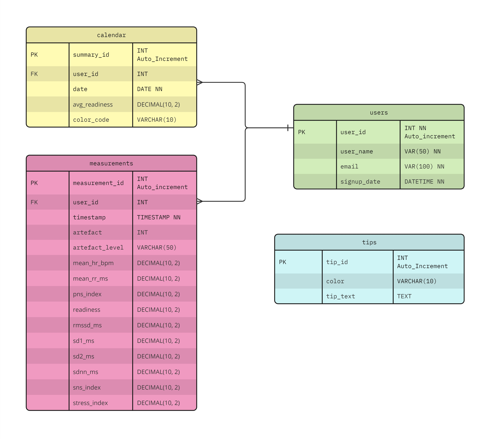

# UniZen

## Description

UniZen is a health-tech app...

## Screenshots


## Client Setup

The client application uses Vite for development and build processes. Below are the scripts and dependencies required.

### Scripts

To run the client application, use the following npm scripts:

- **Development Server**: `npm run dev` - Starts the Vite development server.
- **Build**: `npm run build` - Compiles and bundles the client application for production deployment.
- **Preview**: `npm run preview` - Serves the production build locally for preview.

### Dependencies

- node-fetch: `^3.3.2`

### DevDependencies

- vite: `^5.1.0`

## Server Setup

The server side of the application requires several dependencies to run properly and some development dependencies for an efficient development workflow.

### Dependencies

These packages are necessary for the server application's runtime:


- **bcryptjs**: `^2.4.3` - For hashing and securing passwords.
- **cors**: `^2.8.5` - To enable CORS (Cross-Origin Resource Sharing).
- **dotenv**: `^16.4.1` - To load environment variables from a `.env` file.
- **express**: `^4.18.2` - The web application framework.
- **express-validator**: `^7.0.1` - For validating and sanitizing input data.
- **jsonwebtoken**: `^9.0.2` - For generating and verifying JSON Web Tokens.
- **mysql2**: `^3.9.1` - MySQL client for Node.js.

### DevDependencies

These packages are used during development and are not required in the production environment:

- **eslint**: `^8.56.0` - For ensuring code quality and consistency.
- **eslint-config-google**: `^0.14.0` - Google's ESLint configuration.
- **nodemon**: `^3.1.0` - Utility that automatically restarts the node application when file changes are detected.

### Installing Dependencies

After cloning the repository, navigate to the server directory and run the following command to install all the necessary dependencies:

```bash
npm install
```


## Database Schema




## Project Features


### Live Application


### Documentation and API Reference


## Sources and references


### Contact
If you want to report bugs or give me your feedback, feel free to contact us at javierj@metropolia.fi, vili..., mukke..., salamon...

## Future Development


## Data Flow


